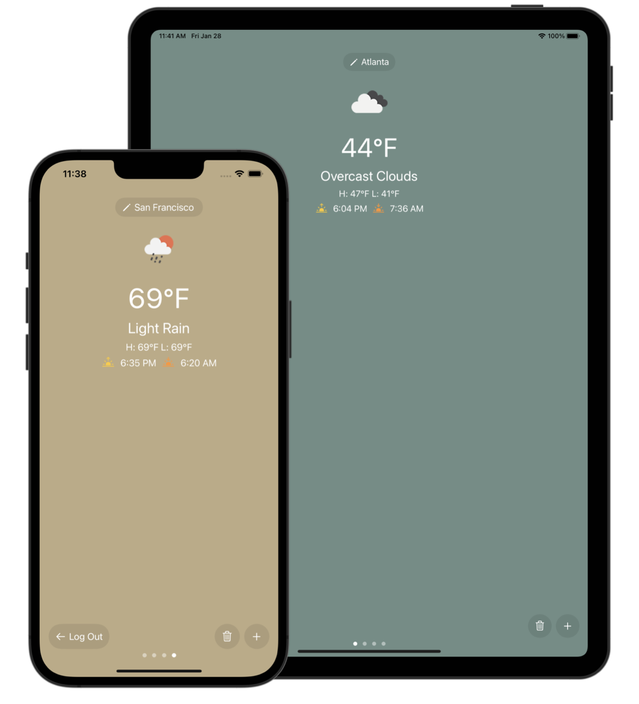
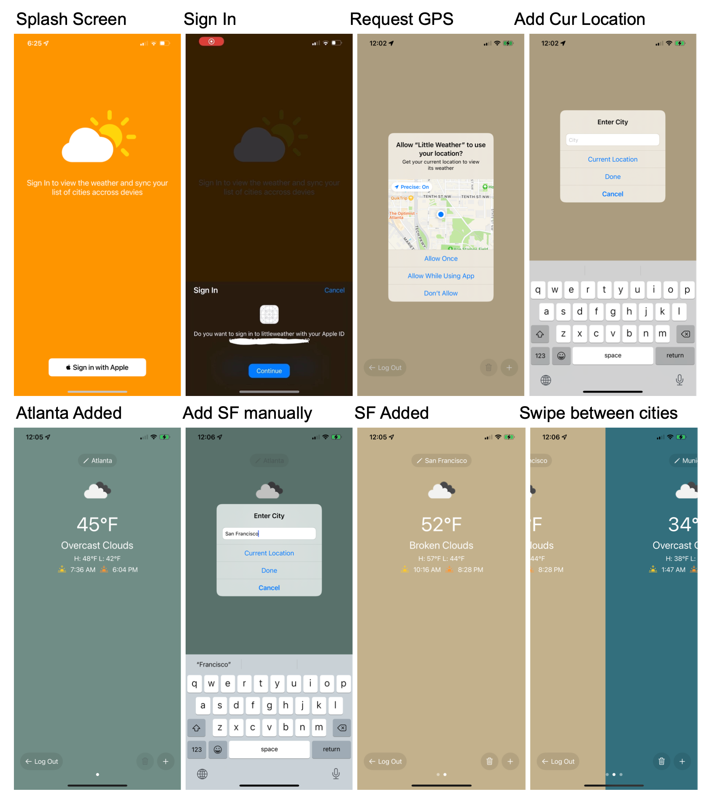

# littleweather
### Project for CS 4261 - Mobile Application & Services (1 week)

littleweather which is a lightweight and friendly weather application. Its is built in Swift using UIKit and runs within the Apple ecosystem on iPhone, iPad, and Mac.
- Dynamic background color calculaced based on temperature and cloud cover
- Displays temperature, weather description, high, low, sunrise, and sunset
- Sign In with Apple for authentication
- Firebase for storing user cities and syncing
- Uses GPS sensors for adding the "Current Location"

